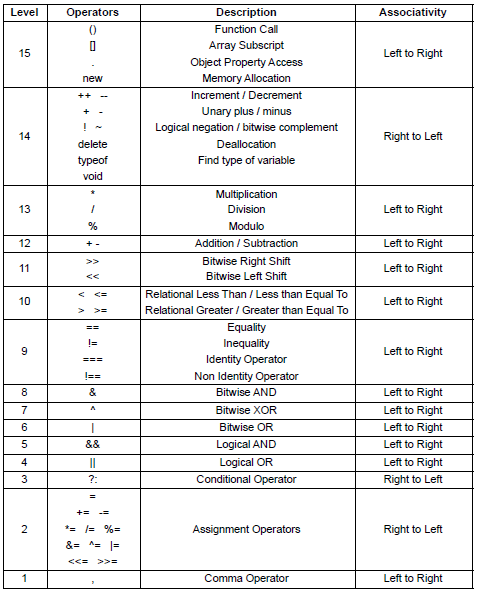

# Operadores

## Operadores aritméticos

[Documentación](https://www.w3schools.com/js/js_arithmetic.asp)

Los operadores aritméticos realizan operaciones aritméticas con números (literales o variables).

<table class="ws-table-all notranslate">
<tbody><tr>
<th style="width:25%">Operator</th>
<th>Description</th>
</tr>
<tr>
<td>+</td>
<td>Addition</td>
</tr>
<tr>
<td>-</td>
<td>Subtraction</td>
</tr>
<tr>
<td>*</td>
<td>Multiplication</td>
</tr>
<tr>
<td>**</td>
<td>Exponentiation (<a href="https://www.w3schools.com/js/js_es6.asp">ES2016</a>)</td>
</tr>
<tr>
<td>/</td>
<td>Division</td>
</tr>
<tr>
<td>%</td>
<td>Modulus (Remainder)</td>
</tr>
<tr>
<td>++</td>
<td>Increment</td>
</tr>
<tr>
<td>--</td>
<td>Decrement</td>
</tr>
</tbody></table>

## Prescedencia de operadores

[Documentación](https://developer.mozilla.org/es/docs/Web/JavaScript/Reference/Operators/Operator_Precedence)

La precedencia de operadores determina el orden en el cual los operadores son evaluados. Los operadores con mayor precedencia son evaluados primero.

<table class="fullwidth-table">
 <tbody>
  <tr>
   <th>Precedencia</th>
   <th>Tipo de operador</th>
   <th>Asociatividad</th>
   <th>Operador</th>
  </tr>
  <tr>
   <td>0</td>
   <td>grouping</td>
   <td>n/a</td>
   <td><code>(</code>…<code>)</code></td>
  </tr>
  <tr>
   <td rowspan="3">1</td>
   <td rowspan="2"><a href="https://developer.mozilla.org/en-US/docs/Web/JavaScript/Reference/Operators/Property_Accessors" title="JavaScript/Reference/Operators/Member_Operators">member</a></td>
   <td rowspan="2">left-to-right</td>
   <td>…<code>.<var>…</var></code></td>
  </tr>
  <tr>
   <td>…<code>[<var>…</var>]</code></td>
  </tr>
  <tr>
   <td><a href="https://developer.mozilla.org/en-US/docs/Web/JavaScript/Reference/Operators/new" title="JavaScript/Reference/Operators/Special_Operators/new_Operator">new</a></td>
   <td>n/a</td>
   <td><code>new</code> … <code>(<var>…</var>)</code></td>
  </tr>
  <tr>
   <td rowspan="2">2</td>
   <td><a href="/en-US/docs/Web/JavaScript/Guide/Functions" title="JavaScript/Reference/Operators/Special_Operators/function_call">function call</a></td>
   <td>left-to-right</td>
   <td>…<code>(<var>…</var>)</code></td>
  </tr>
  <tr>
   <td><a href="/en-US/docs/Web/JavaScript/Reference/Operators/new" title="JavaScript/Reference/Operators/Special_Operators/new_Operator">new</a></td>
   <td>right-to-left</td>
   <td><code>new</code> …</td>
  </tr>
  <tr>
   <td rowspan="2">3</td>
   <td><a href="/en-US/docs/Web/JavaScript/Reference/Operators" title="JavaScript/Reference/Operators/Arithmetic_Operators">increment</a></td>
   <td>n/a</td>
   <td>…<code>++</code></td>
  </tr>
  <tr>
   <td><a href="/en-US/docs/Web/JavaScript/Reference/Operators" title="JavaScript/Reference/Operators/Arithmetic_Operators">decrement</a></td>
   <td>n/a</td>
   <td>…<code>--</code></td>
  </tr>
  <tr>
   <td rowspan="7">4</td>
   <td><a href="/en-US/docs/Web/JavaScript/Reference/Operators" title="JavaScript/Reference/Operators/Logical_Operators">logical-not</a></td>
   <td>right-to-left</td>
   <td><code>!</code>…</td>
  </tr>
  <tr>
   <td><a href="/en-US/docs/Web/JavaScript/Reference/Operators" title="JavaScript/Reference/Operators/Bitwise_Operators">bitwise not</a></td>
   <td>right-to-left</td>
   <td><code>~</code>…</td>
  </tr>
  <tr>
   <td><a href="/en-US/docs/Web/JavaScript/Reference/Operators" title="JavaScript/Reference/Operators/Arithmetic_Operators">unary +</a></td>
   <td>right-to-left</td>
   <td><code>+</code>…</td>
  </tr>
  <tr>
   <td><a href="/en-US/docs/Web/JavaScript/Reference/Operators" title="JavaScript/Reference/Operators/Arithmetic_Operators">unary negation</a></td>
   <td>right-to-left</td>
   <td><code>-</code>…</td>
  </tr>
  <tr>
   <td><a href="/en-US/docs/Web/JavaScript/Reference/Operators/typeof" title="JavaScript/Reference/Operators/Special_Operators/typeof_Operator">typeof</a></td>
   <td>right-to-left</td>
   <td><code>typeof</code> …</td>
  </tr>
  <tr>
   <td><a href="/en-US/docs/Web/JavaScript/Reference/Operators/void" title="JavaScript/Reference/Operators/Special_Operators/void_Operator">void</a></td>
   <td>right-to-left</td>
   <td><code>void</code> …</td>
  </tr>
  <tr>
   <td><a href="/en-US/docs/Web/JavaScript/Reference/Operators/delete" title="JavaScript/Reference/Operators/Special_Operators/delete_Operator">delete</a></td>
   <td>right-to-left</td>
   <td><code>delete</code> …</td>
  </tr>
  <tr>
   <td rowspan="3">5</td>
   <td><a href="/en-US/docs/Web/JavaScript/Reference/Operators" title="JavaScript/Reference/Operators/Arithmetic_Operators">multiplication</a></td>
   <td>left-to-right</td>
   <td><code>*</code></td>
  </tr>
  <tr>
   <td><a href="/en-US/docs/Web/JavaScript/Reference/Operators" title="JavaScript/Reference/Operators/Arithmetic_Operators">division</a></td>
   <td>left-to-right</td>
   <td><code>/</code></td>
  </tr>
  <tr>
   <td><a href="/en-US/docs/Web/JavaScript/Reference/Operators" title="JavaScript/Reference/Operators/Arithmetic_Operators">modulus</a></td>
   <td>left-to-right</td>
   <td><code>%</code></td>
  </tr>
  <tr>
   <td rowspan="2">6</td>
   <td><a href="/en-US/docs/Web/JavaScript/Reference/Operators" title="JavaScript/Reference/Operators/Arithmetic_Operators">addition</a></td>
   <td>left-to-right</td>
   <td><code>+</code></td>
  </tr>
  <tr>
   <td><a href="/en-US/docs/Web/JavaScript/Reference/Operators" title="JavaScript/Reference/Operators/Arithmetic_Operators">subtraction</a></td>
   <td>left-to-right</td>
   <td><code>-</code></td>
  </tr>
  <tr>
   <td rowspan="3">7</td>
   <td rowspan="3"><a href="/en-US/docs/Web/JavaScript/Reference/Operators" title="JavaScript/Reference/Operators/Bitwise_Operators">bitwise shift</a></td>
   <td rowspan="3">left-to-right</td>
   <td><code>&lt;&lt;</code></td>
  </tr>
  <tr>
   <td><code>&gt;&gt;</code></td>
  </tr>
  <tr>
   <td><code>&gt;&gt;&gt;</code></td>
  </tr>
  <tr>
   <td rowspan="6">8</td>
   <td rowspan="4"><a href="/en-US/docs/Web/JavaScript/Reference/Operators" title="JavaScript/Reference/Operators/Comparison_Operators">relational</a></td>
   <td rowspan="4">left-to-right</td>
   <td><code>&lt;</code></td>
  </tr>
  <tr>
   <td><code>&lt;=</code></td>
  </tr>
  <tr>
   <td><code>&gt;</code></td>
  </tr>
  <tr>
   <td><code>&gt;=</code></td>
  </tr>
  <tr>
   <td><a href="/en-US/docs/Web/JavaScript/Reference/Operators/in" title="JavaScript/Reference/Operators/Special_Operators/in_Operator">in</a></td>
   <td>left-to-right</td>
   <td><code>in</code></td>
  </tr>
  <tr>
   <td><a href="/en-US/docs/Web/JavaScript/Reference/Operators/instanceof" title="JavaScript/Reference/Operators/Special_Operators/instanceof_Operator">instanceof</a></td>
   <td>left-to-right</td>
   <td><code>instanceof</code></td>
  </tr>
  <tr>
   <td rowspan="4">9</td>
   <td rowspan="4"><a href="/en-US/docs/Web/JavaScript/Reference/Operators" title="JavaScript/Reference/Operators/Comparison_Operators">equality</a></td>
   <td rowspan="4">left-to-right</td>
   <td><code>==</code></td>
  </tr>
  <tr>
   <td><code>!=</code></td>
  </tr>
  <tr>
   <td><code>===</code></td>
  </tr>
  <tr>
   <td><code>!==</code></td>
  </tr>
  <tr>
   <td>10</td>
   <td><a href="/en-US/docs/Web/JavaScript/Reference/Operators" title="JavaScript/Reference/Operators/Bitwise_Operators">bitwise-and</a></td>
   <td>left-to-right</td>
   <td><code>&amp;</code></td>
  </tr>
  <tr>
   <td>11</td>
   <td><a href="/en-US/docs/Web/JavaScript/Reference/Operators" title="JavaScript/Reference/Operators/Bitwise_Operators">bitwise-xor</a></td>
   <td>left-to-right</td>
   <td><code>^</code></td>
  </tr>
  <tr>
   <td>12</td>
   <td><a href="/en-US/docs/Web/JavaScript/Reference/Operators" title="JavaScript/Reference/Operators/Bitwise_Operators">bitwise-or</a></td>
   <td>left-to-right</td>
   <td><code>|</code></td>
  </tr>
  <tr>
   <td>13</td>
   <td><a href="/en-US/docs/Web/JavaScript/Reference/Operators" title="JavaScript/Reference/Operators/Logical_Operators">logical-and</a></td>
   <td>left-to-right</td>
   <td><code>&amp;&amp;</code></td>
  </tr>
  <tr>
   <td>14</td>
   <td><a href="/en-US/docs/Web/JavaScript/Reference/Operators" title="JavaScript/Reference/Operators/Logical_Operators">logical-or</a></td>
   <td>left-to-right</td>
   <td><code>||</code></td>
  </tr>
  <tr>
   <td>15</td>
   <td><a href="/en-US/docs/Web/JavaScript/Reference/Operators/Conditional_Operator" title="JavaScript/Reference/Operators/Special_Operators/Conditional_Operator">conditional</a></td>
   <td>right-to-left</td>
   <td>… <code>?</code> … <code>:</code> …</td>
  </tr>
  <tr>
   <td rowspan="12">16</td>
   <td rowspan="12"><a href="/en-US/docs/Web/JavaScript/Reference/Operators#Assignment_operators" title="JavaScript/Reference/Operators/Assignment_Operators">assignment</a></td>
   <td rowspan="12">right-to-left</td>
   <td><code>=</code></td>
  </tr>
  <tr>
   <td><code>+=</code></td>
  </tr>
  <tr>
   <td><code>-=</code></td>
  </tr>
  <tr>
   <td><code>*=</code></td>
  </tr>
  <tr>
   <td><code>/=</code></td>
  </tr>
  <tr>
   <td><code>%=</code></td>
  </tr>
  <tr>
   <td><code>&lt;&lt;=</code></td>
  </tr>
  <tr>
   <td><code>&gt;&gt;=</code></td>
  </tr>
  <tr>
   <td><code>&gt;&gt;&gt;=</code></td>
  </tr>
  <tr>
   <td><code>&amp;=</code></td>
  </tr>
  <tr>
   <td><code>^=</code></td>
  </tr>
  <tr>
   <td><code>|=</code></td>
  </tr>
  <tr>
   <td>17</td>
   <td><a href="/en-US/docs/Web/JavaScript/Reference/Operators/yield" title="JavaScript/Reference/Operators/yield">yield</a></td>
   <td>right-to-left</td>
   <td><code>yield</code>…</td>
  </tr>
  <tr>
   <td>18</td>
   <td><a href="/en-US/docs/Web/JavaScript/Reference/Operators/Comma_Operator" title="JavaScript/Reference/Operators/Special_Operators/Comma_Operator">comma</a></td>
   <td>left-to-right</td>
   <td><code>,</code></td>
  </tr>
 </tbody>
</table>

